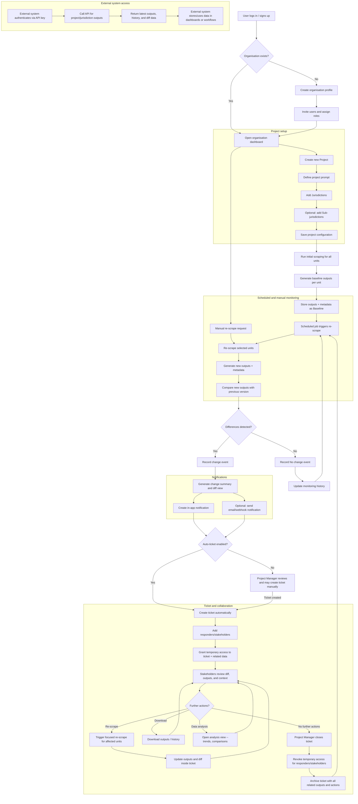

# LegalWatchDog: Product Requirements Document (PRD)

## 1. Product Overview

LegalWatchDog provides automated monitoring of policy, regulatory, and data changes across global jurisdictions. It retrieves information from authoritative sources, generates concise outputs, identifies differences between updates, and notifies the appropriate stakeholders. The system supports multi‑jurisdiction tracking with structured categorisation, and controlled role‑based access, including temporary access for responders and stakeholders during active issues. 

The platform also exposes an API that allows organisations to retrieve monitored data programmatically and integrate results into their internal systems.

## 2. Problem Statement

Global policy, legal, and regulatory environments change frequently, and the information is fragmented across thousands of government portals, central bank sites, regulatory agencies, and official publications. Most organizations still rely on manual monitoring, ad‑hoc email alerts, or scattered spreadsheets managed by individual team members.

Key problems include:

- Important changes are often detected late or missed entirely.
- Monitoring across many regions is labour‑intensive and cannot scale.
- There is no structured historical record to compare previous and current states.
- Collaboration around detected changes is fragmented.
- Lack of consistent monitoring exposes organisations to compliance and operational risks.

LegalWatchDog addresses these challenges by providing structured monitoring, automated scraping, clear difference detection, controlled collaboration workflows, temporary access for stakeholders, and automatic archiving for auditability.

## 3. Goals and Objectives

LegalWatchDog is designed to give organisations a dependable, scalable, and structured way to monitor policy and regulatory changes across different regions and areas of interest. The goals below establish the operational standards the platform must meet to ensure reliability, clarity, and seamless collaboration.

- Provide a reliable system for detecting policy, regulatory, and data changes across multiple jurisdictions.
- Reduce manual monitoring workload and improve the consistency of regulatory tracking.
- Deliver clear, concise, and repeatable outputs for quick understanding of changes.
- Ensure timely notification of responsible stakeholders through a structured workflow.
- Maintain an auditable history of all monitored outputs, comparisons, and related actions.
- Support flexible monitoring scopes across projects, jurisdictions, and sub‑jurisdictions.
- Enable controlled temporary access for responders added only for the duration of active issues.
- Allow re‑scraping, rerunning outputs, and exporting data for deeper analysis.
- Handle both change and no‑change outcomes consistently for operational reliability.
- Provide API access so organisations can retrieve monitored data programmatically and integrate results into external systems.

## 4. User Personas

### 1. Organisation Administrator

Responsible for managing the organisation’s account, configuring access controls, and overseeing all projects. Sets up teams, manages billing where applicable, and ensures adherence to internal compliance requirements.

### 2. Project Manager

Owns specific monitoring projects. Defines the project scope (what to monitor), selects jurisdictions (where to monitor), creates prompts, and reviews outputs. Handles notifications, creates or approves tickets, and assigns responders or stakeholders during active issues.

### 3. Team Member

Has access to the projects assigned to them. Reviews outputs, participates in discussions within tickets/threads, and provides contextual input when needed. Does not manage prompts or jurisdictions.

### 4. Responder/Stakeholder (Temporary Access)

Brought into a project or ticket when specialised review or decision‑making is required. Gains access only for the duration of an active issue and is automatically removed once the ticket is closed.

### 5. External System (API Consumer)

Systems or tools that retrieve monitored data through the LegalWatchDog API for integration into internal dashboards, reporting pipelines, or automated decision processes. Access is programmatic and scoped per organisation.

## 5. User Stories and Acceptance Criteria

### 5.1 Organisation Setup

**User Story:** As an Organisation Administrator, I want to create and manage my organisation’s account so that our team can use LegalWatchDog securely.

**Acceptance Criteria:**

- Admin can create an organisation profile.
- Admin can invite and remove users.
- Admin can assign roles: Administrator, Project Manager, Team Member.
- System must restrict access based on assigned roles.

### 5.2 Project Creation (What to monitor)

**User Story:** As a Project Manager, I want to create a project defining what policy or data area should be monitored so that the system knows what to track.

**Acceptance Criteria:**

- Project Manager can create, edit, and delete projects.
- Each project must include a title, description, and prompt.
- System must validate required fields.
- Project must be accessible only to authorised users.

### 5.3 Jurisdiction Setup (Where to monitor)

**User Story:** As a Project Manager, I want to add jurisdictions to my project so that monitoring can be scoped to specific regions.

**Acceptance Criteria:**

- Manager can add multiple jurisdictions to a project.
- Each jurisdiction can include its own optional prompt.
- System must support: global, continent, country, state, city, coordinate ranges, and custom groupings.
- System must validate jurisdiction format.

### 5.4 Sub‑Jurisdictions (Optional Granularity)

**User Story:** As a Project Manager, I want to create sub‑jurisdictions where needed so that monitoring can be more precise.

**Acceptance Criteria:**

- Manager can add sub‑jurisdictions under any jurisdiction.
- Sub‑jurisdictions can have their own prompts.
- System must inherit or override parent jurisdiction settings as needed.

### 5.5 Scraping and Baseline Output

**User Story:** As a Project Manager, I want the system to run an initial scrape and produce an output so that I have a baseline for future comparisons.

**Acceptance Criteria:**

- System must scrape all configured jurisdiction and sub‑jurisdiction units.
- System must generate a baseline output per unit.
- Output must include: content summary, raw extraction (if applicable), and metadata.
- System must store the baseline securely.

### 5.6 Scheduled Monitoring and Re‑Scraping

**User Story:** As a Project Manager, I want the system to re-scrape sources on schedule or on demand so that I can stay updated on changes.

**Acceptance Criteria:**

- System must run scheduled checks based on project settings.
- System must allow manual re-scraping.
- Outputs must be versioned.
- System must explicitly state when no change is detected.

### 5.7 Difference Detection (Diff)

**User Story:** As a user, I want the system to detect differences between the current output and the baseline so that I know when something has changed.

**Acceptance Criteria:**

- System must compare each new output with the previous version.
- System must highlight what changed.
- Differences must be stored with timestamps.

### 5.8 Notifications

**User Story:** As a Project Manager, I want to be notified when a change occurs so that I can act on it. **Acceptance Criteria:**

- System must notify project managers via in‑app alerts.
- Optional: email or webhook notifications.
- Notification must contain a summary of the detected change.

### 5.9 Ticket/Thread Creation

**User Story:** As a Project Manager, I want a ticket to be created automatically or manually once a change is detected so that I can track the issue.

**Acceptance Criteria:**

- Auto‑ticket created when diff is detected.
- Manager can also create a manual ticket.
- Ticket must include: jurisdiction, output versions, summary of change, and metadata.

### 5.10 Stakeholder Assignment

**User Story:** As a Project Manager, I want to assign responders or stakeholders to a ticket so that the right people handle the issue.

**Acceptance Criteria:**

- Manager can add responders by email.
- Responders gain access only to the specific ticket.
- Access must be removed automatically when the ticket is closed.

### 5.11 Closing and Archiving

**User Story:** As a Project Manager, I want to close a ticket and archive the event so that it remains accessible for future audits.

**Acceptance Criteria:**

- Closing a ticket must revoke temporary access.
- Ticket and outputs must be archived.
- Archived data must remain viewable to authorised users.

### 5.12 API Access

**User Story:** As an API Consumer, I want to retrieve project outputs programmatically so that I can integrate the data into other systems.

**Acceptance Criteria:**

- API must expose project, jurisdiction, and output data.
- API keys must be scoped per organisation.
- Access must follow organisation-level permissions.

## 6. Functional Requirements

### 6.1 Authentication and Access Control

- User account creation and secure authentication.
- Organisation‑level onboarding.
- Role‑based access control: Administrator, Project Manager, Team Member, Responder/Stakeholder.
- Temporary access handling for responders during active tickets.
- Automatic access revocation when tickets are closed.

### 6.2 User and Organisation Management

- Create and manage organisation profiles.
- Invite, remove, and manage users.
- Assign and modify roles.
- Control project‑level visibility and permissions.

### 6.3 Project Management (What to Monitor)

- Create, edit, and delete projects.
- Define project prompts.
- Validate required project fields.
- Display project‑specific monitoring status.

### 6.4 Jurisdiction and Sub‑Jurisdiction Management (Where to Monitor)

- Add multiple jurisdictions per project.
- Support global, continental, country, state, city, coordinate‑range, and custom groupings.
- Add optional prompts for jurisdictions.
- Define sub‑jurisdictions with inherited or overridden prompts.

### 6.5 Scraping and Data Retrieval

- Scrape data from configured sources for each jurisdiction and sub‑jurisdiction.
- Generate baseline outputs.
- Retrieve summaries and raw extracted data.
- Store metadata including timestamps, source URLs, and extraction quality.

### 6.6 Monitoring, Scheduling, and Re‑Scraping

- Automatic scheduled scraping based on project settings.
- Manual re‑scraping on demand.
- Version and store each output.
- Produce explicit "no change detected" outputs.

### 6.7 Difference Detection and Change Processing

- Compare current outputs with previous versions.
- Highlight modifications.
- Store differences with timestamps.
- Trigger notifications and ticket creation where applicable.

### 6.8 Notifications

- In‑app notifications for changes.
- Optional email or webhook alerts.
- Summaries included in all notifications.

### 6.9 Ticketing and Collaboration Workflow

- Automatic or manual ticket creation.
- Include jurisdiction, versions, change summary, and metadata.
- Threaded discussion for collaborative review.
- Add responders and stakeholders.
- Automatic removal of responders when ticket closes.
- Archive closed tickets and related data.

### 6.10 Data Export and Analysis

- Download outputs in supported formats.
- Provide data analysis view for visualising patterns or trends.
- Support exporting version history.

### 6.11 API Access

- Allow programmatic access to project, jurisdiction, and output data.
- Scoped API keys per organisation.
- Permissions must align with role‑based access rules.

### 6.12 Auditability and Compliance

- Maintain complete history of outputs, differences, tickets, and actions.
- Ensure archived data remains viewable to authorised users.
- Provide clear audit trails for regulatory reporting.

## 7. User Flow

## 8. Acceptance Criteria (Summary Verification Across Features)

The following acceptance criteria apply across all functional areas and validate that each feature meets expected behaviour:

### 8.1 Authentication & Access Control
- Users can sign up, authenticate securely, and access only authorised areas.
- Role-based access ensures each role sees only relevant projects and actions.
- Temporary access is granted and automatically revoked when tickets close.

### 8.2 Organisation & User Management
- Administrators can create organisations, invite/remove users, and assign roles.
- Users inherit correct permissions immediately after role changes.
- Project visibility correctly respects organisation and role boundaries.

### 8.3 Project Setup (What to Monitor)
- Projects can be created, edited, and deleted without error.
- Required fields are validated and enforced.
- Project prompts trigger correct scraping behaviour.

### 8.4 Jurisdiction & Sub-Jurisdiction Setup (Where to Monitor)
- Jurisdictions can be added with valid geographic formats.
- Optional prompts correctly influence scraping behaviour.
- Sub-jurisdictions inherit parent configuration unless overridden.

### 8.5 Scraping & Data Retrieval
- Baseline scraping runs successfully across all configured units.
- Outputs include summaries, raw data (if applicable), and metadata.
- Scraping errors surface clearly to Project Managers.

### 8.6 Monitoring & Re-Scraping
- Scheduled scrapes occur at the configured frequency.
- Manual re-scraping runs instantly and logs correctly.
- Version history shows accurate timestamps and output changes.

### 8.7 Difference Detection (Diff)
- System correctly identifies additions, removals, and modifications.
- Diff view highlights changes clearly.
- Timestamps and historical diffs are stored and retrievable.

### 8.8 Notifications
- In-app notifications trigger immediately after change events.
- Email/webhook alerts trigger when enabled.
- Notifications contain sufficient context for decision-making.

### 8.9 Ticketing & Collaboration
- Auto-ticketing triggers reliably when enabled.
- Manual ticket creation is available with required fields.
- Responders gain scoped access only to the ticket.
- Closure revokes access and archives data.

### 8.10 Data Export & Analysis
- Downloads generate correct files.
- Analysis view loads accurate historic and trend data.
- Exported history matches internal records.

### 8.11 API Access
- API keys authenticate correctly and enforce permissions.
- API returns accurate project, jurisdiction, and diff data.
- Rate limiting and error responses behave predictably.

### 8.12 Auditability
- Complete logs exist for scraping, diffs, tickets, and access events.
- Archived tickets remain readable.
- Audit logs cannot be modified by non-admins.

## 9. Dependencies & Risks

### 9.1 External Dependencies
- Availability of external websites, APIs, or government portals being scraped.
- Reliability of third-party proxies or scraping services.
- Email/SMS/webhook providers for notifications.
- Hosting infrastructure for scheduled tasks and scraping workloads.
- Authentication provider (if using a third-party service).

### 9.2 Internal Dependencies
- Scraping engine stability and scaling.
- Correct configuration of prompts.
- Accurate role-based access matrix.
- Storage layer capable of supporting versioning and archival.

### 9.3 Risks
- Source websites may block automated scraping or change structure.
- High scrape frequency may exceed rate limits.
- Slow or failing scrape jobs may delay notifications.
- Incorrect prompts may produce incomplete or misleading outputs.
- Misconfigured access controls may expose sensitive data.
- Large-scale jurisdiction monitoring may increase infrastructure cost.

## 10. Metrics for Success

### 10.1 Monitoring Performance
- Percentage of successful scrapes per day.
- Average time from change occurrence to detection.
- Number of failed or delayed scraping jobs.

### 10.2 Accuracy & Quality
- Accuracy of difference detection.
- Percentage of outputs validated as correct by users.
- Reduction in missed policy/regulation changes.

### 10.3 User Operations
- Time saved per team compared to manual monitoring.
- Number of tickets resolved within defined SLA.
- Average time responders spend reviewing changes.

### 10.4 Adoption & Engagement
- Number of active projects and jurisdictions monitored.
- Frequency of API usage for automation.
- Retention rate of organisations using the platform.

### 10.5 Reliability & System Health
- Uptime of scraping and monitoring services.
- Stability of notification delivery.
- Storage availability for version history and archived tickets.

